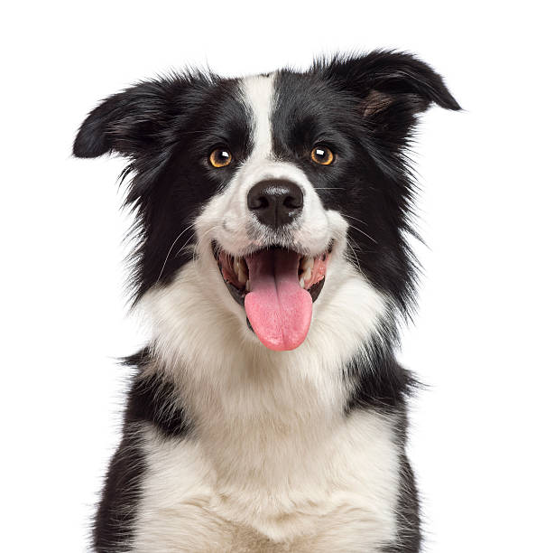

# img_to_svg
Just a simple python notenook (and a python command line script) to convert an image into a svg img made up dots.  As the name suggest this project was inspired by dot matrix pattern of ink printing. Though this version only creates a greyscale image.

 <small>1. Original Image, 2. Style 0 (dot-matrix), 3. Style 1 (lines)</small>

### How to use
* Open this notebook in Google Colab OR clone this repo and install requirements `pip install numpy opencv-python`. (I prefer google colab method)
    * If, on google colab upload your image the compute instance from the side pane
* Set the image file location in `img_path`
* `rows` is the height of the resultant svg (not pixel height, just the number of column of dots.)
* `depth` is the different and distinct radii dots can have. (Basically different level of greyscale values)

NOTE :- The `dog.jpg` file is property of istockphoto.com ([link to the image](https://www.istockphoto.com/photo/black-and-white-border-collie-dog-with-tongue-out-gm157653757-22296488?phrase=border+collie))